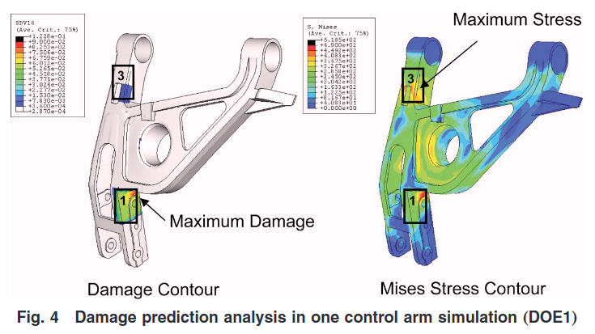

<!-- %%%%%%%% Document Metadata %%%%%%%% -->
# yinEfficientRandomField2009

Date Created: April 12, 2023

- [yinEfficientRandomField2009](#yinefficientrandomfield2009)
  - [Annotations](#annotations)
  - [Figures](#figures)
  - [Abstract](#abstract)
<!-- %%%%%%%%%%%%%%%%%%%%%%%%%%%%%% -->

<!-- START WRITING BELOW -->

<!-- %%%%%%%%%%%%%%%%%%%%%%%%%%%%%% -->
## Annotations
<!-- \renewcommand{\theequation}{1.\arabic{equation}} -->
Highlights the burden of and need to efficiently compute the propagation of uncertainty from length scale components into system-level performance.
Multiscale and metamodeling carried out by #Karhunan-Loeve-Expansion [24], #Univariate-Dimension-Reduction-Method [25, 26], the #Gaussian-Quadrature [27], and other #metamodeling techniques [30-32].
Karhunan-Loeve reduces dimension by random sampling of a random variable field which is then transformed into Gauss field.
These random fields can represent #microstructure variation in a spatial domain (Figs. 2-3).
#FEM discretizes this spatial domain to represent the interactions of these random fields summarized into variables of similar statistical behavior.

Karhunan-Loeve reduces number of statistical moment elements.
==**Fig. 4 verified in ([Horstemeyer, 2001](zotero://select/library/items/W347XFLN)).**==
153 #design-of-experiments showed intuitive results that location/magnitude of maximum #damage depended on initial #porosity.
#metamodeling by #kriging [31] (Fig. 9).

Monte Carlo Simulation applied between neighboring mesh elements until statistical correlations converge.

**Multiscale design verified by Monte Carlo.**

Sources of Note:
- *insert text here$\dots$*

## Figures

## Abstract
An integrated design framework that employs multiscale analysis to facilitate concurrent product, material, and manufacturing process design is presented in this work.
To account for uncertainties associated with material structures and their impact on product performance across multiple scales, efficient computational techniques are developed for propagating material uncertainty with random field representation.
Random field is employed to realistically model the uncertainty existing in material microstructure, which spatially varies in a product inherited from the manufacturing process.
To reduce the dimensionality of random field representation, a reduced order Karhunen–Loeve expansion is used with a discretization scheme applied to finite-element meshes.
The univariate dimension reduction method and the Gaussian quadrature formula are used to efficiently quantify the uncertainties in product performance in terms of its statistical moments, which are critical information for design under uncertainty.
A control arm example is used to demonstrate the proposed approach.
The impact of the initial microscale porosity random field produced during a casting process on the product damage is studied and a reliability-based design of the control arm is performed.
<!-- %%%%%%%%%%%%%%%%%%%%%%%%%%%%%% -->

<!-- %%%%%%%% End Document %%%%%%%% -->