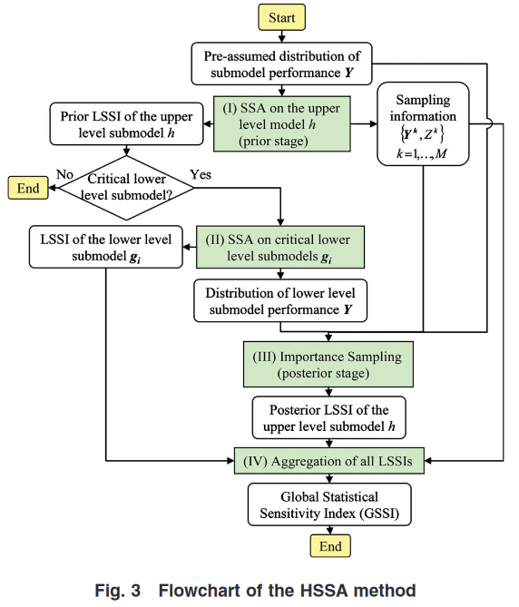
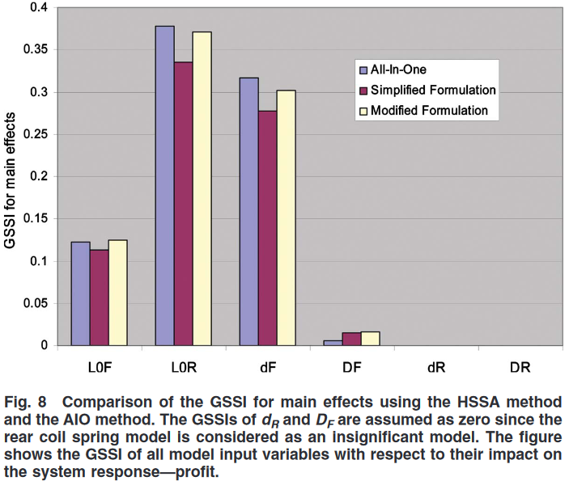
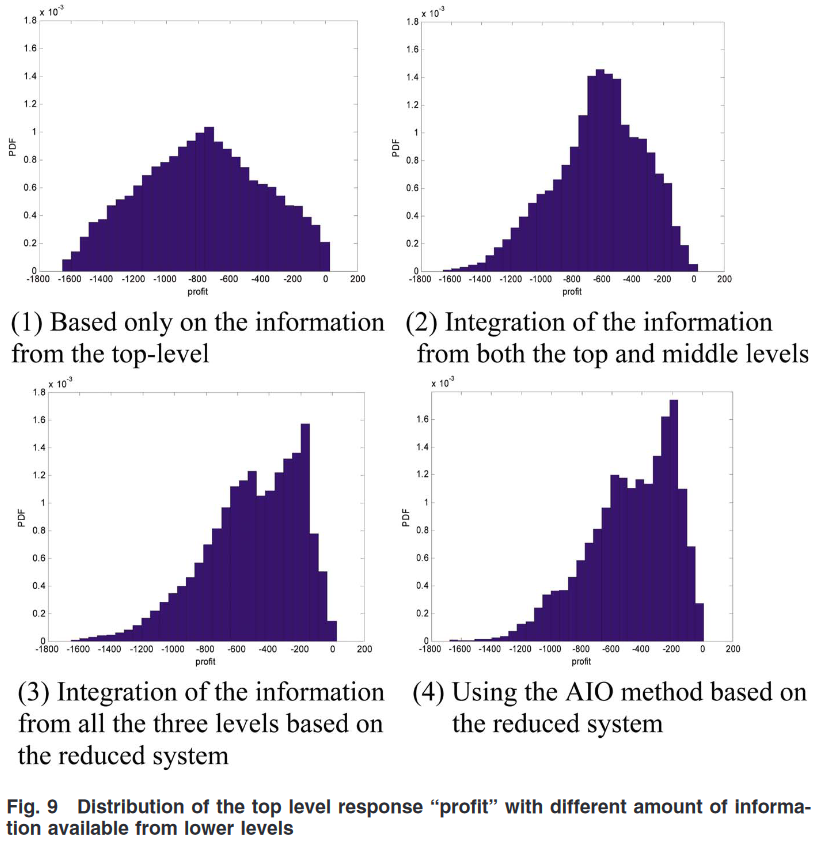

<!-- %%%%%%%% Document Metadata %%%%%%%% -->
# A Hierarchial Statistical Sensitivity Analysis Method for Complex Engineering Systems Design

Date Created: April 12, 2023

- [A Hierarchial Statistical Sensitivity Analysis Method for Complex Engineering Systems Design](#a-hierarchial-statistical-sensitivity-analysis-method-for-complex-engineering-systems-design)
  - [Annotations](#annotations)
  - [Figures](#figures)
  - [Abstract](#abstract)
<!-- %%%%%%%%%%%%%%%%%%%%%%%%%%%%%% -->

<!-- START WRITING BELOW -->

<!-- %%%%%%%%%%%%%%%%%%%%%%%%%%%%%% -->
## Annotations
<!-- \renewcommand{\theequation}{1.\arabic{equation}} -->
The hierarchical approach laid out is similar to that employed in [ICME](../../../class/engr-851-001-integrated-computational-materials-engineering.md), wherein, #Mark-F-Horstemeyer found that the lower length scale effects of #void-nucleation and #void-coalescence were more significant than #void-growth.
Lower level sub-models (length scales) are analyzed similarly to determine their overall contribution on upper models measured with Sobol’s Method [27] and their #Statistical-Sensitivity-Index (SSI) [16].
Evaluation is sped up with #metamodeling instead of the expensive #Monte-Carlo-Simulation.
A simple formulation for approximating the #Global-Statistical-Sensitivity-Index was shown to be sufficient.
This sufficient approximation is postulated as theorem in Eq. 9 and proven in the appendix.
Non-linear interactions between lower and upper length scale effects are accounted for by an adjustment coefficient, $AC$ derived in the appendix.
Figures 8 and 9 (below) highlight advantage of #Hierarchical-Statistical-Sensitivity-Index by skipping the evaluation of insignificant components and accounting for non-linearities.

Sources of Note:
- *insert text here$\dots$*

## Figures

## Abstract
Statistical sensitivity analysis (SSA) is playing an increasingly important role in engineering design, especially with the consideration of uncertainty. However, it is not straightforward to apply SSA to the design of complex engineering systems due to both computational and organizational difficulties. In this paper, to facilitate the application of SSA to the design of complex systems especially those that follow hierarchical modeling structures, a hierarchical statistical sensitivity analysis (HSSA) method containing a top-down strategy for SSA and an aggregation approach to evaluating the global statistical sensitivity index (GSSI) is developed. The top-down strategy for HSSA is introduced to invoke the SSA of the critical submodels based on the significance of submodel performances. A simplified formulation of the GSSI is studied to represent the effect of a lower-level submodel input on a higher-level model response by aggregating the submodel SSA results across intermediate levels. A sufficient condition under which the simplified formulation provides an accurate solution is derived. To improve the accuracy of the GSSI formulation for a general situation, a modified formulation is proposed by including an adjustment coefficient (AC) to capture the impact of the nonlinearities of the upper-level models. To improve the efficiency, the same set of samples used in submodel SSAs is used to evaluate the AC. The proposed HSSA method is examined through mathematical examples and a three-level hierarchical model used in vehicle suspension systems design.
<!-- %%%%%%%%%%%%%%%%%%%%%%%%%%%%%% -->

<!-- %%%%%%%% End Document %%%%%%%% -->