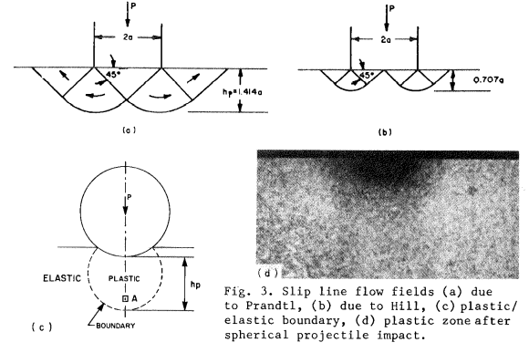

<!-- %%%%%%%% Document Metadata %%%%%%%% -->
# Mechanical Aspects of Residual Stress Development in Shot Peening

- [Mechanical Aspects of Residual Stress Development in Shot Peening](#mechanical-aspects-of-residual-stress-development-in-shot-peening)
	- [Annotations](#annotations)
	- [Figures](#figures)
	- [Abstract](#abstract)
	- [Notes](#notes)
		- [Statical Aspects](#statical-aspects)
			- [Plastic Zone](#plastic-zone)
			- [Residual Stress after Load Removal](#residual-stress-after-load-removal)
		- [Dynamical Aspects](#dynamical-aspects)
			- [Depth of Plastic Zone](#depth-of-plastic-zone)
		- [Residual Stress Distribution](#residual-stress-distribution)
			- [Spherical Model](#spherical-model)
			- [Aspects of Repeated Loading](#aspects-of-repeated-loading)
<!-- %%%%%%%%%%%%%%%%%%%%%%%%%%%%%% -->

<!-- START WRITING BELOW -->

<!-- %%%%%%%%%%%%%%%%%%%%%%%%%%%%%% -->
*Reading: September 16, 2021*
## Annotations
[[fatigue]] and [[stress-corrosion]] performance affected by shot conditions and subsequent [[residual-stress]]. Almen test strip arc height function of surface integral of elastic recovery in impact sites and shot conditions. Overcomes simple beam and plate theory exemption of residual stress history and local plasticity with novel spherical cavity expansion model by assuming engendered stress trends material back to undeformed state, *minus elastic stress*. Residual stress, in industry is measured only with Almen test strip arc height, is function of shot conditions. Stress-source equations can find [[plastic-zone]] depth if the whole plate is assumed to be unloaded simultaneously and $\sigma_{R}(z) = 0$, *but ignores hardening effects*. Viscoelastoplastic deformation of target in plastic zone as residual stress. Equations mimic saturation and arc-height curves from [[shakedown]] effects. *If local temperature rises significantly during impact, then [[work-softening]] rate may exceed [[work-hardening]] rate, which may be why peak residual stress occurs below material surface and curves (steeper and shorter with greater velocities) plateau.* Expressions produce impact parameters and residual stress without metallurgical measure. Indent volume for time, $\bar{V} = \frac{NMV_{0}^{2}}{2\bar{P}}t,~\bar{P} = \frac{2}{2\pi}(2.5\pi\rho)^{\frac{1}{5}}\bigl[\frac{E}{1 - \nu^{2}}\bigr]^{\frac{4}{5}}v^{\frac{2}{5}}$. Knowledge lacked wrt [[Bauschinger-Effect]], [[work-hardening]], and strain rate. Competing effects--[[work-hardening]], [[work-softening]], and [[shakedown]]--for macroscale, plastic flow.

Sources of Note:
- [Flavenot and Nikulari (1977)](https://liberty.alma.exlibrisgroup.com/discovery/openurl?institution=01LIBU_INST&vid=01LIBU_INST:Services&date=1979&artnum=&aulast=Niku-Lari&issue=350&isbn=&spage=70&title=Mec%20Mater%20Electr&auinit=A.&atitle=Measurement%20of%20Residual%20Stresses:%20The%20Bending%20Deflection%20and%20the%20Stress%20Source%20Methods.&aufirst=A.&sid=Elsevier:Scopus&volume=&pages=70-78&auinit1=A&issn=&_service_type=getFullTxt&epage=78&id=doi:) explore shot conditions on residual stress: *La Mesure des Contraintes Residuelles: Methode de la (Fleche) Methods de lat (Source de Contraintes). Les Memoires Techniques du CETIM (31)* translated *Measurement of Residual Stresses: The Bending Deflection and the Stress Source Methods*. Also see *Impact: The Theory and Physical Behavior of Colliding Solids*
- [Goldsmith (1960)](https://openlibrary.org/books/OL5816987M/Impact_the_theory_and_physical_behaviour_of_colliding_solids.) and [Johnson (1972)](https://openlibrary.org/books/OL5322045M/Impact_strength_of_materials) explore single-ball impacts: *Impact: the theory and physical behaviour of colliding solids, Arnold, London* and *Impact Strength of Materials, Arnold London*.
- [Shaw and DeSalva (1970)](https://doi.org/10.1115/1.3427785) validate [[Boussinesq-Problem]]: *"A new approach to plasticity and its application to blunt two-dimensional indenters" Trans. ASME J. Eng. Industry, 92, 469-479*.
- [Engel (1976)](https://www.sciencedirect.com/bookseries/tribology-series/vol/2/suppl/C) explains enhancing erosion when [[shakedown]] limit exceeded: *"Impact Wear of Materials". Elsevier Scientific Publishing Co., New York*.
- [Kachanov (1974)](https://www.google.com/books/edition/Fundamentals_of_the_Theory_of_Plasticity/__vBAgAAQBAJ?hl=en&gbpv=0) formally defines [[Bauschinger-Effect]]: *Fundamentals of the Theory of Plasticity. MIR Publishers, Moscow*.

## Figures
|  |
|:--:|
| Figure 2a: Boussinesq solution for concentrated load P. \\(\label{fig:boussinesq_problem}\\) |

|  |
|:--:|
| Figure 5a - Stress wave fronts commensurate during impact of a projectile on a semi-infinite solid. \\(\label{fig:stress_wave_front}\\) |

|  |
|:--:|
| Figure 3 - Slip line flow fields (a) due to Prandtl, (b) due to Hill, (c) plastic/elastic boundary, (d) plastic zone after spherical projectile impact. fig:slip_line_flow_fields |

|  |
|:--:|
| Figure 9: (a) Variation of $\frac{h_{p}}{R}$ and $\frac{Z}{R}$ with the number of impacts. (b) Plastic zone overlap due to three adjacent impacts. \\(\label{fig:plastic_zone_for_number_of_impacts}\\) |

|  |
|:--:|
| Figure 10: (a) Pressurized cavity model. (b) Radial and and hoop stress in an elastic/plastic sphere. (c) Residual hoop stress distribution. (d) Residual stress distribution with reversed yielding. \\(\label{fig:cavity_model}\\) |

## Abstract
Single shot-target interactions explored to augment experimental research with simple expressions for plastic zone as a function of shot velocity and density. Validated with experiment. Observes the [[Bauschinger-Effect]].

## Notes
### Statical Aspects
Residual stress stored in compressed material in plastic zone. Flavenot and Nikulari (1977) explore various shot conditions. **$\dots$** magnitude of residual compressive stress \dots play a significant role in the fatigue and stress corrosion performance $\dots$ High strain-rate elasticity and inelasticity during single impact. Goldsmith (1960) and Johnson (1972) explore single-ball impacts. Multiple impact analytical research must include *[[shakedown]]*, *[[Bauschinger-Effect]]*, and *[[strain-softening]]* from cyclic plastic deformation. The Boussinesq equation,

\\[\begin{equation}
	\sigma = s\frac{P}{2\pi d^{2}}
	
	\label{eq:boussinesq_equation}
\end{equation}
\\]

can find the elastic stress of some concentrated load (\ref{fig:boussinesq_problem}), where $P$ is the applied load and $d$ is diameter of stress field.

#### Plastic Zone
Figure \ref{fig:slip_line_flow_fields} reveals discrepancy and error of existing models: Prandtl and Hill equations. "Shaw and DeSalva (1970)" discuss depth of plastic zone and match Hertzian solution to [[Boussinesq-Problem]]: 

\\[\begin{equation}
	\frac{h_{P}}{R} = 2.57\sqrt{\frac{\bar{Z}}{R}}
	
	\label{eq:plastic_zone_depth}
\end{equation}\\]

$h_{P}$, the plastic zone depth was found to be $\approx 1.816a$ below the surface. For two-dimensional analysis, such as for multiple impact scenarios, Eq. \eqref{eq:plastic_zone_depth} evolves to $\approx 2.99a$ or fully into: $$\frac{h_{P}}{R} = 4.23\sqrt{\frac{\bar{Z}}{R}}$$

#### Residual Stress after Load Removal
Tresca yield criterion for applying and removing concentrated load: $\sigma_{1} - H_{1} = Y$ and $H_{2} = H_{1} - Y$. **FEM for numerical analysis.** Plastic zones coalesce for uniform zone under medium material surface. Conventional arc height of Almen test strip found if surface integral of elastic recovery for each shot is known up to a limit.

### Dynamical Aspects
\\[
	\bar{P} = \frac{2}{2\pi}(2.5\pi\rho)^{\frac{1}{5}}\bigl[\frac{E}{1 - \nu^{2}}\bigr]^{\frac{4}{5}}v^{\frac{2}{5}}
	
	\label{eq:max_average_pressure}
\\]

\\[
	\bar{t} = 2.943\bigl[2.5\pi\rho(\frac{1 - \nu^{2}}{E})\bigr]^{\frac{2}{5}}\frac{R}{v^{\frac{1}{5}}}
	
	\label{eq:impact_time_max_avg_pressure}
\\]

The maximum, average pressure and impact time can be calculated from material parameters, and stress waves produced in impact bodies--because inertia--must be examined. Strain energy imparted to both shooting and target bodies. Figure \ref{fig:stress_wave_front} reveals the dilatational (push-pull) wave speed,

\\[
	\omega_{s} = \sqrt{\frac{\lambda + 2\mu}{\rho}}
	
	\label{eq:p_wave_speed}
\\]

and the rotational (distortional) shake wave speed,

\\[
	\omega_{s} = \sqrt{\frac{\mu}{\rho}}
	
	\label{eq:s_wave_speed}
\\]

where $\lambda$ and $\mu$ are Lame constants and $\rho$ the material density of the elastic target. Rayleigh waves carry most energy and able to travel further into the target material than the push-pull (P) or shake (S) waves. Because the P wave grazes the free surface, a head (H) wave is generated, which is a shear wave. Rigid projectiles impacting comparatively softer targets makes incident a plastic wave from the point of contact by:

\\[
	c_{P}^{2} = \frac{K}{\rho}\bigl[\frac{1 + \frac{H`(\epsilon)}{3K}}{1 - \frac{H`(\epsilon)}{9K}}\bigr]
	
	\label{eq:hopkins_wave_speed}
\\]

where $K$ is the bulk modulus and $H`(\epsilon)$ the tangent modulus from $\sigma = Y + H(\epsilon)$ where $Y$ is uniaxial yield stress. Equation \eqref{eq:plastic_zone_depth} holds true because the shape and depth of the plastic zone is very similar between dynamic shot impingement and static indentation. A plastic zone will become saturated after so many impacts, but can grow to limits with more impact energy: e.g. multiple impacts in proximity form a larger, uniform plastic zone. Plastic zone develops during collision before unloading waves diminish it away.

Strain rates in the target at the impact site can be found by Eqs. \eqref{eq:radial_strain_rate} and \eqref{eq:hoop_strain_rate} where $V$ and $R$ are the shot velocity and radius, respectively, and $r$ is the radial distance from impact in target.

\\[
	\dot{\epsilon_{r}} = \frac{2VR^{2}}{r^{3}}
	
	\label{eq:radial_strain_rate}
\\]

\\[
	\dot{\epsilon_{\theta}} = -\frac{VR^{2}}{R^{3}}
	
	\label{eq:hoop_strain_rate}
\\]

These strain rates become important for high-rate impacts, because steel can change its yield stress with higher strain-rates. If inertia effects are ignored, then using Eq. \eqref{eq:avg_resisting_dynamic_pressure}

\\[
	\bar{P} = 3Y
	
	\label{eq:avg_resisting_dynamic_pressure}
\\]

implies that the shot decelerates according to Eq. \eqref{eq:shot_deceleration}:

\\[
	M\frac{dv}{dt} = -\pi a^{2}\bar{P}
	
	\label{eq:shot_deceleration}
\\]

where projectile mass, $M = \frac{4}{3}\rho\pi R^{3}$ relies on the contact radius, $a$. Final indentation found by integrating Eq. \eqref{eq:shot_deceleration} wrt penetration ($\approx \frac{a^{2}}{2R}$) to give:

\\[
	\frac{\bar{Z}}{R} = \Phi\sqrt{\frac{2}{3}}
	
	\label{eq:final_indentation}
\\]

where $\Phi$ is the Damage Number:

\\[
	\Phi = \sqrt{\frac{\rho V^{2}}{\bar{P}}}
	
	\label{eq:damage_number}
\\]

#### Depth of Plastic Zone
Because the same plastic zone can be created from static and dynamic impacts, Eq. \eqref{eq:plastic_zone_depth} can be expanded to:

\\[
	\frac{h_{p}}{R} = 2.57\Phi\sqrt{\frac{2}{3}}
	
	\label{eq:plastic_zone_depth_expanded}
\\]

which implies that plastic zone depth increases with shot size, density, and velocity, and decreases with the hardness of target. The *[[Meyer-Indentation-Law]]* relates resisting pressure to contact radius by

\\[
	\bar{P} = \bar{P_{y}}(\frac{a}{R})^{n}
	
	\label{eq:meyer_indentation_law}
\\]

where $n$ is the work-hardening exponent and ${P_{y}}$ is the plastic flow stress, which means final indentation can be described by modifying Eq. \eqref{eq:final_indentation}

\\[
	\frac{\bar{Z}}{R} = \bigl[\frac{(4 + n)}{6(2)^{\frac{n}{2}}}\Phi(\frac{a}{R})^{n}\bigr]^{\frac{2}{4 + n}}
	
	\label{eq:final_indentation_modified}
\\]

Therefore, the effective plastic zone depth becomes Eq. \eqref{eq:plastic_zone_depth_effective}

\\[
	\frac{h_{p}}{R} = 2.57\bigl[\frac{(4 + n)}{6(2)^{\frac{n}{2}}}\Phi(\frac{a}{R})^{n}\bigr]^{\frac{1}{4 + n}}
	
	\label{eq:plastic_zone_depth_effective}
\\]

Equation \eqref{eq:plastic_zone_depth_effective} reduces to Eq. \eqref{eq:plastic_zone_depth_expanded} if $n = 0$ for a non-hardening material. Using another *[[Meyer-Indentation-Law]]* on Eq. \eqref{eq:meyer_indentation_law} with $\sigma = B\epsilon^{n}\dot{\epsilon}^{m}$ modifies to

\\[
	\bar{P} = A(\frac{a}{R})^{n}(\frac{\dot{a}}{R})^{m}
	
	\label{eq:meyer_indentation_law_modified}
\\]

where $\bar{P_{yr}} = A(\frac{\dot{a_{r}}}{R})^{m}$ is the plastic flow pressure at reference indentation rate, $V_{R}$ and strain rate index, $m$. Equation \eqref{eq:shot_deceleration} can be integrated with Eq. \eqref{eq:meyer_indentation_law_modified} into:

\\[
	\frac{\bar{Z}}{R} = \frac{1}{2}\bigl[\frac{4}{3}(\frac{4 + n - m}{2 - m})(\frac{V_{r}}{V_{o}})^{m}(\frac{\rho V_{o}^{2}}{\bar{P_{yr}}})\bigr]^{\frac{2}{4 + n - m}}
	
	\label{eq:final_indentation_ultimate}
\\]

Because shot peening is typically done by blasting shot from a pressurized nozzle or by some at a certain rpm, Eq. \eqref{eq:plastic_zone_depth_expanded} can be modified with jet blasting parameters: peening pressure, $P_{p} = kV^{\beta}$; downstream velocity of shot, $V$; nozzle dimension, shot, and density constant, $k$; and, air-stream flow characteristic, $\beta$:

\\[
	\frac{h_{p}}{R} = 2.57\sqrt{\frac{2\rho}{3\bar{P}}}\bigl(\frac{P_{P}}{k}\bigr)^{\frac{2}{\beta}}
	
	\label{eq:plastic_zone_depth_jet}
\\]

### Residual Stress Distribution
Analogically, shot peening is akin to a nail hammered into a black of wood: normal and tangential frictional forces imparted from the wood's reluctance to move. **Final, average stress found by integrating the progressing, local, plastic strains with overall, uniform thickness, $h_{p}$.** Assuming that plane sections within target plate remain plane limits simple beam and plate bending theories by **neglecting residual stress history and local plasticity**. A circumvention of this limitation assumes an engendered "stress source" that trends a material back to the undeformed state to balance the internal stresses after deformation, that the residual stress zone can be evaluated by:

\\[
	\begin{align*}
	\sigma_{R}(Z) &= \sigma_{bending} + \sigma_{axial} + (\sigma_{s} = -E\epsilon(z)) \\\\
	\epsilon(Z) &= \epsilon_{m}cos(\frac{\pi z}{2h_{p}})\bigg[1(h_{p}) = \begin{cases}
		1 	& 0 \leq z \leq h_{p} \\\\
		0 	& z > h_{p}
	\end{cases}\bigg]
	\end{align*}
	
	\label{eq:residual_stress_strain_at_depth_z}
\\]

Including and integrating from $0 \leq z \leq h_{p}$ the bending moment, $\bar{M}$ (Eq. \eqref{eq:beam_bending_moment}) and axial force, $\bar{F}$ (Eq. \eqref{eq:beam_axial_force})

\\[
	\bar{M} = \int_{0}^{h}(\sigma(z)(\frac{h}{2} - z)b)dz
	
	\label{eq:beam_bending_moment}
\\]

\\[
	\bar{F} = \int_{0}^{h}(\sigma(z)b)dz
	
	\label{eq:beam_axial_force}
\\]

and substituting into Eq. \eqref{eq:residual_stress_strain_at_depth_z} gives the formal definition of residual stress distribution:

\\[
	\sigma_{R}(z) = e\epsilon_{m}\bigg[\frac{12}{\pi h}(1 - \alpha)(\frac{h}{2} - z)C_{1} + \frac{2\lambda}{\pi}(1 - \alpha)C_{2} - \frac{\epsilon(z)}{\epsilon_{m}}\bigg]
	
	\label{eq:residual_stress_distribution}
\\]

wherein, $$\lambda = \frac{h_{p}}{h}$$, $$C_{1} = 1 - 2\lambda + \frac{4\lambda}{\pi}(1 - \alpha)cos(\frac{\pi\alpha}{2(1 - \alpha)}) + sin(\frac{\pi\alpha}{2(1 - \alpha)})$$, and $$C_{2} = 1 + sin(\frac{\pi\alpha}{2(1 - \alpha)})$$. $\epsilon_{m}$ is found by assuming planar sections in a beam of some length, $L$ into some arc height, $\delta$, and expressing curvature as $\frac{M}{EI}$ (Eq. \eqref{eq:epsilon_m}).

\\[
	\epsilon_{m} = \frac{2}{3}\bigl(\frac{\pi h\delta}{\lambda^{2}L^{2}h_{p}(1 - \alpha)C_{1}}\bigr)
	
	\label{eq:epsilon_m}
\\]

Substituting $h_{p}$ from  Eq. \eqref{eq:plastic_zone_depth_expanded} into $\lambda = \frac{h_{p}}{h}$ means that $\lambda$ can be known by:

\\[
	\lambda = 2.57(\frac{R}{h})\Phi\sqrt{\frac{2}{3}}
	
	\label{eq:lambda}
\\]

This implies that residual stress distribution is a function of not the arc height alone, as industry seeks to do conventionally, but the distribution is also a function of shot density, $\rho$, velocity, $V$, radius, $R$, and hardness, $\bar{P}$. **However, these "stress-source" equations ignore elastic stress!**

If a spherical model with quasi-static conditions into a spherical cavity (Fig. \ref{fig:cavity_model}) is used, then the residual stresses under impact sites that resist the bending and axial forces of the plate evaluates to Eq. \eqref{eq:residual_stress_distribution_with_elasticity}:

\\[
	\frac{\sigma(z)}{Y} = \begin{cases}
		1 - 2ln\bigl(\frac{h_{p} + R}{z + R}\bigr) - 2\bigl[1 - \bigl(\frac{h_{p} + R}{h + R}\bigr)^{3}\bigr] 	& 0 \leq z \leq h_{p} \\\\
		\frac{2}{3}\bigl(\frac{h_{p} + R}{h + R}\bigr)^{3}\bigl[\frac{1}{2}\bigl(\frac{h + R}{z + R}\bigr)^{3} + 1\bigr] 	& h_{p} \leq z \leq h
	\end{cases}
	
	\label{eq:residual_stress_distribution_with_elasticity}
\\]

*Reading: September 28, 2021*
#### Spherical Model
Figure \ref{fig:cavity_model}(c) shows  the "spherical shell" like residual stress distribution if each impact site unloaded independently. This formulation is expanded in Jachanov (1974) and Johnson and Mellor (1962). However, if the whole plate is assumed to unload simultaneously (such as in Eq. eq:residual_stress_strain_at_depth_z), then Eq. \eqref{eq:residual_stress_distribution_with_elasticity} gets plugged into Eqs. eq:beam_bending_moment and eq:beam_axial_force. This modifies $\sigma(z)$ to:

\\[
	\sigma_{R}(z) = \sigma(z) - \frac{12\bar{M}}{h^{3}b}(\frac{h}{2} - z) - \frac{\bar{F}}{bh}
	
	\label{eq:sigma_z_modified}
\\]

which can be broken into the bending and axial forces:

$$\begin{align*}
\frac{\bar{M}}{Y} &= h_{p}(\frac{h}{2} + R) - R(h + R)ln(1 + \frac{h_{p}}{R}) + \frac{h_{p}}{3}(h - h_{p})\bigl[1 - \bigl(\frac{h_{p} + R}{h + R}\bigr)^{3}\bigr] - \\
&~~~~\frac{1}{12}\bigl[\bigl(\frac{h_{p} + R}{h + R}\bigr)^{3}\bigl[(h + R)(3h + 2R) - 4h_{p}(h - h_{p})\bigr] + \bigl(h - 2R - 4h_{p}\bigr)^{2}\bigr] \\
\frac{\bar{F}}{Y} &= 2Rln(1 + \frac{h_{p}}{R}) - \frac{4h_{p}}{3} + \frac{1}{6}\bigl(\frac{h_{p} + R}{h + R}\bigr)^{3}(3h - R) + \frac{1}{6}(h_{p} + R)
\end{align*}$$

This can be furthered simplified if $h >> h_{p}$ and $h >> R$:

$$\begin{align*}
\frac{\bar{M}}{Y} &\cong \frac{5}{6}h_{p}h - hRln(1 + \frac{h_{p}}{R}) - \frac{(h_{p} + R)^{3}}{3h} \\
\frac{\bar{F}}{Y} &\cong \frac{h_{p} + R}{6} - \frac{4h_{p}}{3} + 2Rln(1 + \frac{h_{p}}{R}) + \frac{(h_{p} + R)^{3}}{2h^{2}}
\end{align*}$$

Using Eq. \eqref{eq:plastic_zone_depth} for $\frac{h_{p}}{R}$, a residual stress distribution may be calculated directly from impact parameters; however, **neglect of hardening puts kink at elastic/plastic transition of stress-strain curve!** Setting $\sigma_{R}(z) = 0$ allows one to find the transition depth between compression and tension. In practice, local impact sites unload individually.

#### Aspects of Repeated Loading
[[shakedown]]
: An elastic, resultant stress state when subsequent impact, contact stresses plus the residual stress do not exceed the yield stress.

Plastic flow of the material occurs when the applied stresses exceed the [[shakedown]] limit: e.g. elastoplastic material through rollers (Merwin and Johnson, 1963). Saturation curves and arc-height can be viewed as [[shakedown]] problems.

[[auto-frettage]]
: If [[shakedown]] occurs in a sphere or cylinder, which act as if hardened in compression on first loading.

When loads exceed the [[shakedown]] limit, [[work-softening]] or [[plastic-fatigue]] can occur: e.g. rapid failure of wire under cyclic bending. And apparently *enhances erosion* **(Engel, 1976)???** [[work-softening]] can also occur if the local temperature rises from many, high velocity impacts. If true, the [[work-softening]] rate (especially near the material surface) can predominate [[work-hardening]] rate. *This may explain why the peak residual stress occurs below the surface and why the saturation curve plateaus.*

[[Bauschinger-Effect]]
: Previous plastic deformation decreases material resistance to subsequent plastic deformation of opposite sign (Kachanov, 1974). *This may be as a result of elastic recovery.*

Eq. \eqref{eq:shot_deceleration} can relate projectile kinetic energy to indentation volume: $\frac{1}{2}MV_{0}^{2} = \bar{P}\bar{V}$, where $\bar{V} \cong \frac{\pi a^{4}}{4R}$. If $N$ is shots per second, then the rate of volume dent creation can be found with the mass flow rate, $NM$ by Eq. \eqref{eq:volume_dent_rate}:

\\[
	\bar{V} = \frac{NMv_{0}^{2}}{2\bar{P}}
	
	\label{eq:volume_dent_rate}
\\]

Shifting the volume of material by creating more surface area can be correlated to the arc-height at time, $t$ (Eq. \eqref{eq:volume_dent_rate_time}):

\\[
	\bar{V} = (\frac{NMV_{0}^{2}}{2\bar{P}})t
	
	\label{eq:volume_dent_rate_time}
\\]

>Equation \eqref{eq:volume_dent_rate_time} indicates that if $\bar{P}$ does change due to multiple impacts (i.e. with time), then $\bar{V}$ (and consequently the arc height) will continue to increase linearly with time. Howver, repeated impact obviously increases $\bar{P}$ as manifested in the reduction of increments in $\bar{Z}$ and $h_{p}$ with further impacts (Fig. \ref{fig:plastic_zone_for_number_of_impacts}). The manner in which $\bar{P}$ increases is naturally governed by the aspects discussed above, but it is fair to say that, whether due to [[strain-hardening]], [[strain-rate]], or [[shakedown]], the volume of $\bar{P}$ tends to increase further and further and thus the gradient of the line described by Eq. \eqref{eq:volume_dent_rate_time} will consequently decrease with time produced a curve resembling that of saturation. Equation \eqref{eq:volume_dent_rate_time} also shows that a steeper curve, and hence faster saturation, may be hard by high velocity shots and high mass flow rate. <cite> Al-Hassani
<!-- %%%%%%%%%%%%%%%%%%%%%%%%%%%%%% -->

<!-- %%%%%%%% End Document %%%%%%%% -->