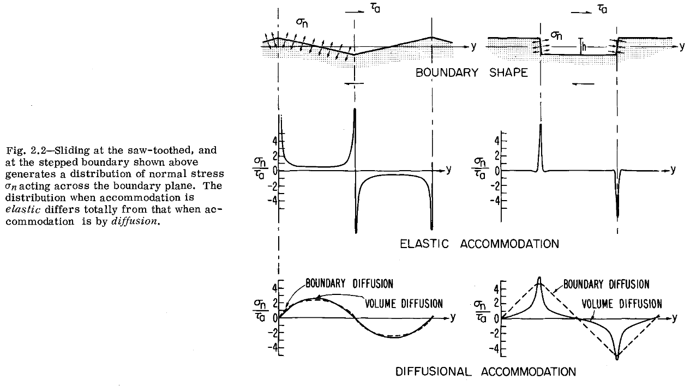
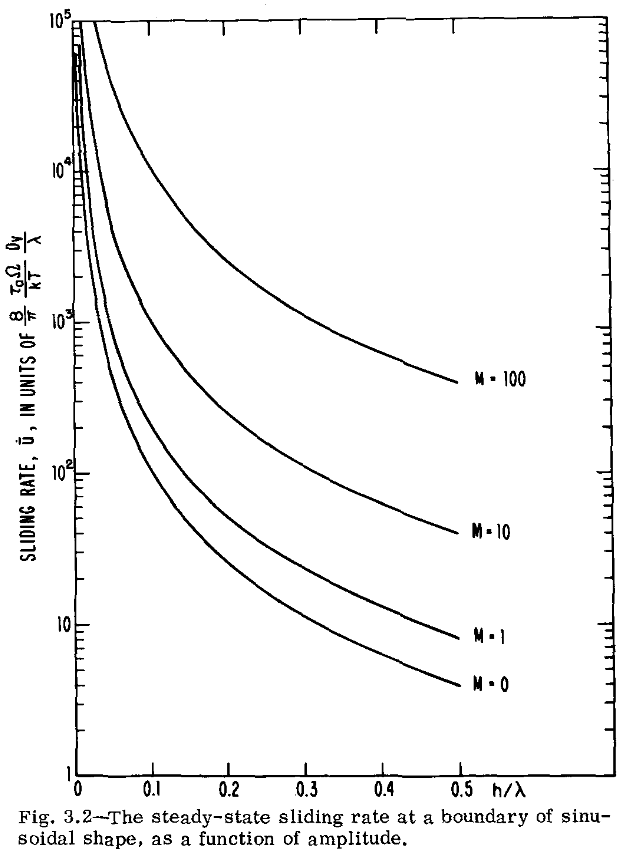

<!-- %%%%%%%% Document Metadata %%%%%%%% -->
# On Grain Boundary Sliding and Diffusional Creep

Date Created: April 12, 2023

- [On Grain Boundary Sliding and Diffusional Creep](#on-grain-boundary-sliding-and-diffusional-creep)
  - [Annotations](#annotations)
  - [Figures](#figures)
  - [Abstract](#abstract)
<!-- %%%%%%%%%%%%%%%%%%%%%%%%%%%%%% -->

<!-- START WRITING BELOW -->

<!-- %%%%%%%%%%%%%%%%%%%%%%%%%%%%%% -->
## Annotations
<!-- \renewcommand{\theequation}{1.\arabic{equation}} -->
An array of grains under shear stress will elastically accommodate that stress until the component sum of normal stresses at grain boundaries balance that out.
Given sufficient shear stress, this elastic limit is overcome and grains slide past each other on their boundary and diffuse with neighboring grains.
This diffusion with other neighboring grains may occur in this elastic limit and seeks to reduce internal stress fields: i.e. creep by the input energy of a static stress and the material statically straining by diffusion or dislocation motion.

Sources of Note:
- *insert text here$\dots$*

## Figures

|  |
|:--:|
| The more non-planar, the slower the grain boundary sliding. |

## Abstract
The problem of sliding at a nonplanar grain boundary is considered in detail.
The stress field, and sliding displacement and velocity can be calculated at a boundary with a shape which is periodic in the sliding direction (a wavy or stepped grain boundary):
a) when deformation within the crystals which meet at the boundary is purely elastic,
b) when diffusional flow of matter from point to point on the boundary is permitted.
The results give solutions to the following problems.
1) How much sliding occurs in a polycrystal when neither diffusive flow nor dislocation motion is possible?
2) What is the sliding rate at a wavy or stepped grain boundary when diffusional flow of matter occurs?
3) What is the rate of diffusional creep in a polycrystal in which grain boundaries slide?
4) How is this creep rate affected by grain shape, and grain boundary migration?
5) How does an array of discrete particles influence the sliding rate at a grain boundary and the diffusional creep rate of a polycrystal?

The results are compared with published solutions to some of these problems.
<!-- %%%%%%%%%%%%%%%%%%%%%%%%%%%%%% -->

<!-- %%%%%%%% End Document %%%%%%%% -->