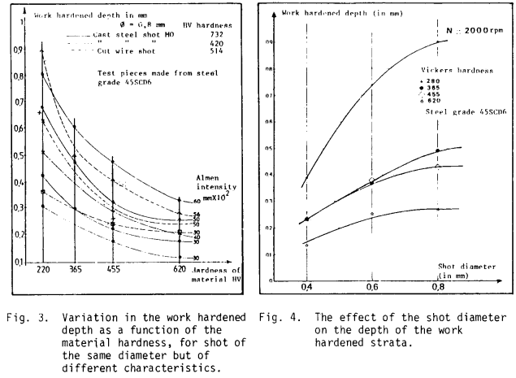
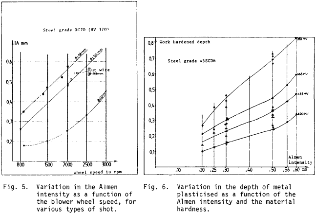
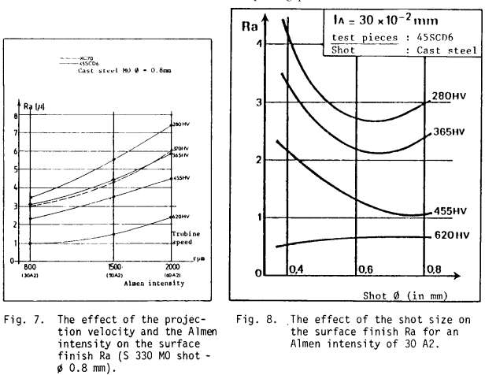
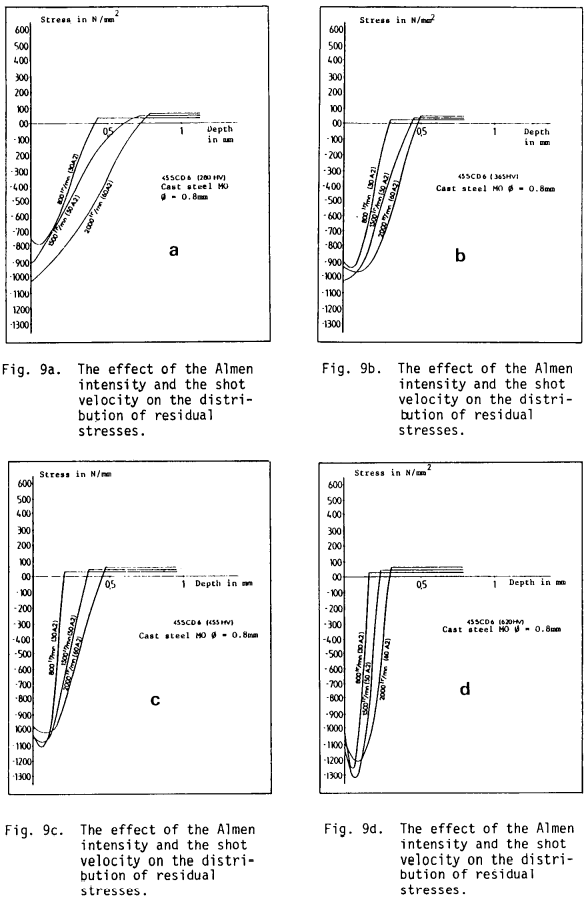
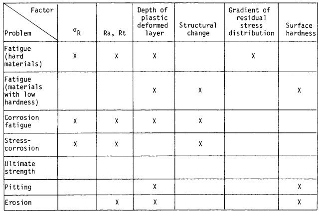
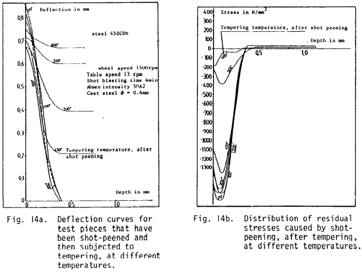

tags: math-heavy almen-intensity residual-stress-field

<!-- %%%%%%%% Document Metadata %%%%%%%% -->
# Overview on the Shot Peening Process
Date Created: 211005

- [Overview on the Shot Peening Process](#overview-on-the-shot-peening-process)
	- [Annotations](#annotations)
	- [Figures](#figures)
	- [Abstract](#abstract)
	- [Notes](#notes)
		- [Source Subtitle](#source-subtitle)
<!-- %%%%%%%%%%%%%%%%%%%%%%%%%%%%%% -->

<!-- START WRITING BELOW -->

<!-- %%%%%%%%%%%%%%%%%%%%%%%%%%%%%% -->
## Annotations
Velocity, size and type, and part hardness factor into component [[residual-stress]] distribution, depth of [[plastic-zone]], and [[surface-roughness]]. Induced residual, compressive stresses resist [[fatigue]] and [[stress-corrosion]] cracks; however, [[residual-stress]] is lost at elevated temperatures but depth of [[plastic-zone]] remains. This transient nature make difficult calculating material behavior over time.

Mechanical Property Relations:
- The bigger the shot, the deeper the [[plastic-zone]].
- Harder target yields lower [[Almen-intensity]]; harder penetrator yields higher [[Almen-intensity]].
- The faster the shot, the greater the [[Almen-intensity]]; however, shot velocity has not been directly measured.
- [[surface-roughness]] increases for greater [[Almen-intensity]] and for larger, softer shot.
- Harder target stunts [[residual-stress]] shape.
- Annealing relaxes [[residual-stress]] distribution, but retains [[plastic-zone]] depth, which factors into [[fatigue]], [[stress-corrosion]], [[corrosion-fatigue]], [[pitting]], and [[erosion]].
- Optimization of shot hardness and size for [[surface-roughness]].

Sources of Note:
- *insert text here$\dots$*

## Figures
|  |
|:--:|
| Figure 3: Variation in the [[work-hardening]] depth as a function of the material hardness, for shot of the same diameter but of different characteristics. Figure 4: The effect of the shot diameter on the depth of the [[work-hardening]] strata. \\(\label{fig:nikulari1987_fig3and4_shot_characteristics_vary_peening_properties}\\) |

|  |
|:--:|
| Figure 5: Variation in the [[Almen-intensity]] as a function of the blower wheel speed, for various types of shot. Figure 6: Variation in the depth of metal plasticized as a function of the [[Almen-intensity]] and the material hardness. \\(\label{fig:nikulari1987_fig5and6_almen_intensity_and_plastic_zone_depth_for_shot_hardness_and_velocity}\\) |

|  |
|:--:|
| Figure 7: The effect of the projection velocity and the [[Almen-intensity]] on the [[surface-finish]], Ra (S 330 MO shot $\varnothing~0.8mm$. Figure 8: The effect of the shot size on the [[surface-finish]], Ra for an [[Almen-intensity]] of 30 A2. \\(\label{fig:nikulari1987_fig7and8_surface_roughness_for_almen_intensity_and_shot_size}\\) |

|  |
|:--:|
| Figure 9: The effect of the [[Almen-intensity]] and the shot velocity on [[residual-stress-distribution]]. \\(\label{fig:nikulari1987_fig9_residual_stress_distribution_for_almen_intensity_and_shot_velocity}\\) |

|  |
|:--:|
| The most influential factor as produced by [[shot-peening]] is the depth of the [[plastic-zone]]. [[fatigue]] and corrosion [[fatigue]] most affected by [[shot-peening]]. \\(\label{fig:nikulari1987_table_of_mechanical_property_factors}\\) |

|  |
|:--:|
| Figure 14: a) Deflection curves for test pieces that have been [[shot-peening]] and then subjected to tempering, at different temperatures; b) Distribution of [[residual-stress]] caused by [[shot-peening]], after tempering, at different temperatures. \\(\label{fig:nikulari1987_fig14_temperature_dependence_of_deflection_and_plastic_zone}\\) |

## Abstract
[[shot-peening]] is a [[cold-working]] process which allow to increase the resistance of materials and parts against [[fatigue]], fretting, [[stress-corrosion]] cracking and other mechanical and conjoint mechanical and chemical behaviors. It is largely used in the mechanical and aeronautical industry. The technique consists of propelling at high speed small beads of particles (on steel, cast iron, glass or ceramics) against the part to be treated. The size of the beads can vary from 0.1 to 1.3 mm. The main advantage of this particular surface treatment is that it increases the [[fatigue]] life of mechanical parts subjected to dynamic stresses by generating compressive [[residual-stress]] on the surface of the material. Industrial parts such as helical springs, rockers, welded joints, propeller, blades and other aircraft parts, transmission shafts torsion bars etc. are always shot peened. At a time when optimum characteristics are being demanded of mechanical components and structures, [[shot-peening]] is being increasingly chosen by engineers to meet such demand. Therefore it is necessary to know the effect of the technological parameters of [[shot-peening]] upon the [[fatigue]] influencing parameters such as [[surface-roughness]], [[residual-stress]] and the [[work-hardening]] depth.

## Notes
*insert text here$\dots$*
### Source Subtitle
*insert text here$\dots$*
<!-- %%%%%%%%%%%%%%%%%%%%%%%%%%%%%% -->

<!-- %%%%%%%% End Document %%%%%%%% -->