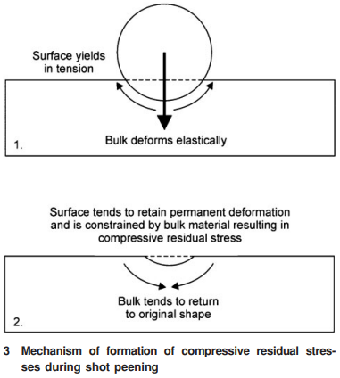
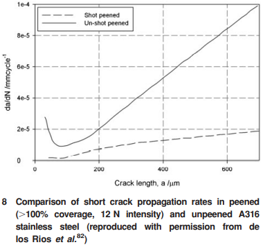

tags: residual-stress-field hardening cracks fatigue review

<!-- %%%%%%%% Document Metadata %%%%%%%% -->
# Life Assessment Methodologies Incorporating Shot Peening Process Effects: Mechanistic Consideration of Residual Stresses and Strain Hardening Part 1 - Effect of Shot Peening on Fatigue Resistance

Date Created: October 07, 2021

- [Life Assessment Methodologies Incorporating Shot Peening Process Effects: Mechanistic Consideration of Residual Stresses and Strain Hardening Part 1 - Effect of Shot Peening on Fatigue Resistance](#life-assessment-methodologies-incorporating-shot-peening-process-effects-mechanistic-consideration-of-residual-stresses-and-strain-hardening-part-1---effect-of-shot-peening-on-fatigue-resistance)
	- [Annotations](#annotations)
	- [Figures](#figures)
	- [Abstract](#abstract)
	- [Notes](#notes)
		- [Source Subtitle](#source-subtitle)
<!-- %%%%%%%%%%%%%%%%%%%%%%%%%%%%%% -->

<!-- START WRITING BELOW -->

<!-- %%%%%%%%%%%%%%%%%%%%%%%%%%%%%% -->
## Annotations
Fatigue life affected by #surface-roughness (#texture) and #residual-stress profiles. *"Complete #residual-stress-distribution rarely determined by experiment."* [[finite-element-model]] limited by constitutive material models and physical testing, which greatly affect the #residual-stress-distribution. Little is known of strain-hardening affects. "[lots] of consistency in results between methods has raised questions as to which method is most appropriate." A validated model needs to be accepted by scientific community. #shot-peening is beneficial for [[HCF]], despite #surface-roughness insignificantly accelerating #crack-initiation, by the #strain-hardening inhibiting #crack-propagation; however considered less beneficial in [LCF](../../class/engr-743-001-damage-and-fracture/low-cycle-fatigue.md) because of high-amplitude, applied stresses relaxing the #residual-stress, which allows the dislocations to recover. Understanding this interplay, along with temperature dependence, is crucial to understand #crack-growth and how #residual-stress might relax.

Sources of Note:
- *insert text here$\dots$*

## Figures
|  |
|:--:|
| Figure 3: Mechanism of formation of compressive #residual-stress during #shot-peening. \\(\label{fig:soady2013_fig3_deformation_mechanism}\\) |

|  |
|:--:|
| Figure 8: Comparison of short #crack-propagation rates in peened (>100% coverage, 12 N intensity) and unpeened A316 stainless steel. \\(\label{fig:soady2013_fig8_shot_peening_mitigating_crack_propagation}\\) |

## Abstract
Shot peening is a well known process applied to components in order to improve their fatigue resistance. In recent years, there has been an increasing interest in including the effects of the shot peening process in life assessment models since this would allow a reduction in conservatism compared to those in current application. The present paper seeks to review firstly the effects of the shot peening process (surface roughening, strain hardening and compressive #residual-stresses) and how the magnitude of these effects can be determined both experimentally and numerically. The reasons for the beneficial effect of shot peening on fatigue resistance are reviewed; this includes consideration of how different operating conditions can affect the magnitude of the benefit. The second part of the review details the life assessment approaches which have been developed to date incorporating these effects and seeks to identify the areas in which further development is still required before the models can be applied in structural integrity assessments.

## Notes
*insert text here$\dots$*

### Source Subtitle
*insert text here$\dots$*
<!-- %%%%%%%%%%%%%%%%%%%%%%%%%%%%%% -->

<!-- %%%%%%%% End Document %%%%%%%% -->