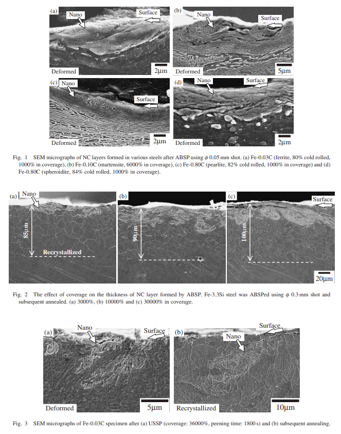

<!-- %%%%%%%% Document Metadata %%%%%%%% -->
# Comparison of Nanocrystalline Surface Layer in Steels Formed by Air Blast and Ultrasonic Shot Peening

Date Created: October 05, 2021

- [Comparison of Nanocrystalline Surface Layer in Steels Formed by Air Blast and Ultrasonic Shot Peening](#comparison-of-nanocrystalline-surface-layer-in-steels-formed-by-air-blast-and-ultrasonic-shot-peening)
	- [Annotations](#annotations)
	- [Figures](#figures)
	- [Abstract](#abstract)
	- [Notes](#notes)
		- [Source Subtitle](#source-subtitle)
<!-- %%%%%%%%%%%%%%%%%%%%%%%%%%%%%% -->

<!-- START WRITING BELOW -->

<!-- %%%%%%%%%%%%%%%%%%%%%%%%%%%%%% -->
## Annotations
Sharp boundaries just under the [[nanocrystalline-layer]], which is very hard, separate from bulk material. **Annealing shows slow [[grain-growth]] without [[recrystallization]].** [[nanocrystalline-volume]] larger in ABSP than USSP. Deformed structure region is thicker and the strain is smaller in ABSP than USSP. [[shot-peening]] produces [[nanocrystalline-volume]] with extreme hardness; sharp boundaries; dissolution of existing [[cementite]]; and no annealing [[recrystallization]]. Cast steel shot--$\varnothing 0.05 mm$ @ $190\frac{m}{s}$) and $\varnothing 0.3 mm$ @ $100\frac{m}{s}$--at steel of varying concentrations of [[martensite]], [[pearlite]], [[spherodite]], and [[ferrite]]. Later annealed at 873 K for 3,600 s. 

Sources of Note:
- *insert text here$\dots$*

## Figures
|  |
|:--:|
| These figures well show that target composition and hardness vary [[plastic-zone]] depth and the sharp boundaries between the [[nanocrystalline]] and [[recrystallization]] layers. \\(\tag{fig:todaka2004_fig1and2and3_sem_for_ferritic_structures} \label{fig:todaka2004_fig1and2and3_sem_for_ferritic_structures}\\) |

## Abstract
Surface nanocrystallization in various steels by shot peening (both air blast (ABSP) and ultrasonic (USSP)) was investigated. In all the shot-peened specimens, the equiaxed nanocrystals with grain size of several 10 nm were observed at the surface regions. The depth of nanocrystalline (NC) layers was several μm. The NC layers have extremely high hardness and were separated from the deformed structure regions just under the NC layers with sharp boundaries. By annealing, the NC layers show the substantially slow grain growth without recrystallization. These characteristics are similar to those observed in the specimens treated by ball milling, ball drop and particle impact deformation. Comparing ABSP and USSP at the similar peening condition, the produced volume of NC region in ABSP is larger than that in USSP.

## Notes
*insert text here$\dots$*
### Source Subtitle
*insert text here$\dots$*
<!-- %%%%%%%%%%%%%%%%%%%%%%%%%%%%%% -->

<!-- %%%%%%%% End Document %%%%%%%% -->