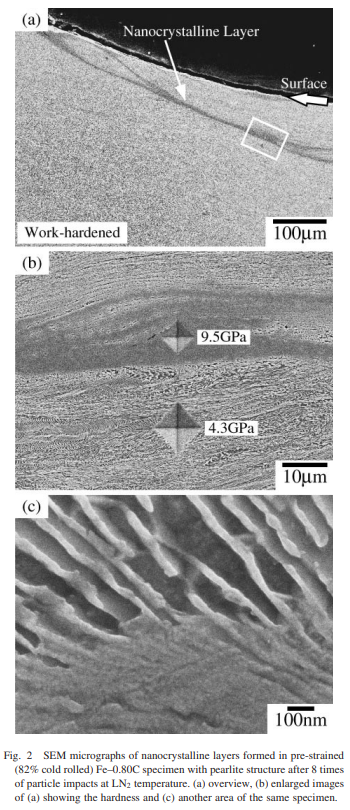
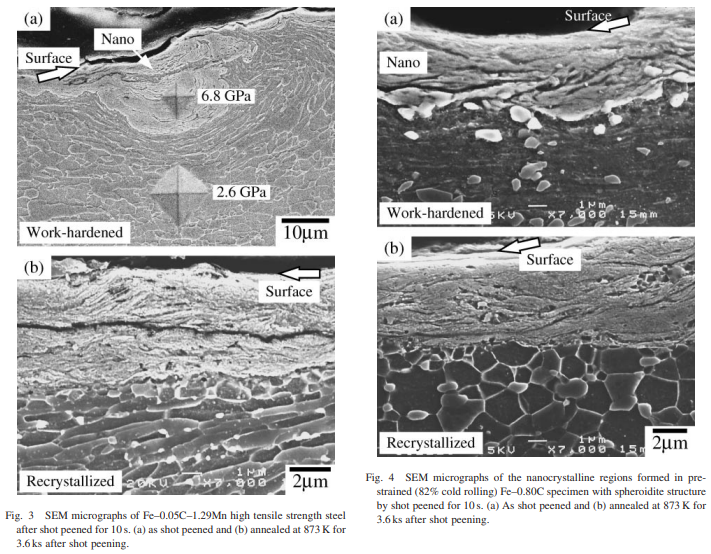

tags: nanocrystalline steel grain-size recrystallization hardness annealing

<!-- %%%%%%%% Document Metadata %%%%%%%% -->
# Formation of Nanocrystalline Structure in Steels by Air Blast Shot Peening

Date Created: October 05, 2021

- [Formation of Nanocrystalline Structure in Steels by Air Blast Shot Peening](#formation-of-nanocrystalline-structure-in-steels-by-air-blast-shot-peening)
	- [Annotations](#annotations)
	- [Figures](#figures)
	- [Abstract](#abstract)
	- [Notes](#notes)
		- [Source Subtitle](#source-subtitle)
<!-- %%%%%%%%%%%%%%%%%%%%%%%%%%%%%% -->

<!-- START WRITING BELOW -->

<!-- %%%%%%%%%%%%%%%%%%%%%%%%%%%%%% -->
## Annotations
Suggests that [[nanocrystalline-layer]] produced by large strains and preferred in high [[strain-rate]] and low temperature conditions (*think [[void-nucleation]]*). [[shot-peening]] well produces a [[nanocrystalline-layer]], as confirmed by #TEM observations, microhardness measurements, and annealing experiments with **no recrystallization but slow [[grain-growth]] from annealing**. [[nanocrystalline-layer]], [[sharp-interface]], and [[cementite-dissolution]] at nanocrystalline layer similar to that seen in [[ball-milling]]. **[[recrystallization]] occurs through the whole specimen except the [[nanocrystalline-layer]].**

Sources of Note:
- *insert text here$\dots$*

## Figures
|  |
|:--:|
| #SEM micrographs of [[nanocrystalline-layer]] formed in pre-strained (82% cold-rolled) Fe-0.80C specimen with [[pearlite]] structure after 8 times of particle impacts at $LN_{2}$ temperature (a) overview, (b) enlarged images of (a) showing the hardness, and (c) another area of the same specimen. \\(\label{fig:umemoto2017_fig2_sem_of_nanocrystal_layer}\\) |
|  |
|:--:|
| [[recrystallization]] occurs in the whole specimen--e.g. the [[deformation-layer]]--and not the [[nanocrystalline-layer]]. \\(\label{fig:umemoto2017_fig3and4_sem_micrograph_shot_peened_and_annealed}\\) |

## Abstract
The formation of nanocrystalline structure (#NS) on the surface of bulk steel samples by a particle impact and air blast shot peening techniques was studied. Nanocrystalline layers with several microns thick were successfully fabricated by these methods. The nanocrystalline layers produced in the present study have extremely high hardness and separated from adjacent deformed morphology region with sharp boundaries. By annealing, nanocrystalline layers showed slow grain growth without recrystallization. Those characteristics are similar to those observed in the #NS produced by ball milling and a ball drop deformation. It was suggested that to produce #NS by deformation a large strain is a necessary condition and a high strain rate and low temperature are favorable conditions.

## Notes
*insert text here$\dots$*

### Source Subtitle
*insert text here$\dots$*
<!-- %%%%%%%%%%%%%%%%%%%%%%%%%%%%%% -->

<!-- %%%%%%%% End Document %%%%%%%% -->