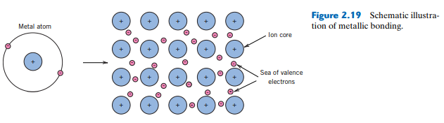

<!-- %%%%%%%% Document Metadata %%%%%%%% -->
# [Materials Science](Materials_Science_and_Engineering_an_Int.pdf)

- [Materials Science](#materials-science)
  - [Chapter 1 - Materials Science](#chapter-1---materials-science)
    - [Historical Perspective](#historical-perspective)
    - [Materials Science and Engineering](#materials-science-and-engineering)
    - [Why Study?](#why-study)
    - [Classification of Materials](#classification-of-materials)
    - [Advanced Materials](#advanced-materials)
    - [Modern Materials' Needs](#modern-materials-needs)
    - [Chapter 1 Keywords](#chapter-1-keywords)
  - [Chapter 2 - Atomic Structure and Interatomic Bonding](#chapter-2---atomic-structure-and-interatomic-bonding)
    - [Introduction](#introduction)
    - [Atomic Structure](#atomic-structure)
      - [Fundamental Concepts](#fundamental-concepts)
      - [Electrons in Atoms](#electrons-in-atoms)
      - [The #Periodic-Table-of-Elements](#the-periodic-table-of-elements)
    - [Atomic Bonding in Solids](#atomic-bonding-in-solids)
      - [Bonding Forces and Energies](#bonding-forces-and-energies)
      - [Primary Interatomic Bonds](#primary-interatomic-bonds)
        - [#ionic bonding](#ionic-bonding)
        - [#covalent bonding](#covalent-bonding)
        - [[[metallic-bonding]]](#metallic-bonding)
      - [#secondary-bonding](#secondary-bonding)
        - [Fluctuating Induced Dipole Bonds](#fluctuating-induced-dipole-bonds)
        - [Polar Molecule-Induced Dipole Bonds](#polar-molecule-induced-dipole-bonds)
        - [Permanent Dipole Bonds](#permanent-dipole-bonds)
      - [#mixed-bonding](#mixed-bonding)
      - [[[molecules]]](#molecules)
      - [Bonding Type-Material Classification Correlations](#bonding-type-material-classification-correlations)
    - [Summary](#summary)
    - [[[PSPP]] Summary](#pspp-summary)
    - [Chapter 2 Keywords](#chapter-2-keywords)
  - [Chapter 3 - The Structure of Crystalline Solids](#chapter-3---the-structure-of-crystalline-solids)
    - [Introduction](#introduction-1)
    - [Crystal Structures](#crystal-structures)
      - [Fundamental Concepts](#fundamental-concepts-1)
      - [Unit Cells](#unit-cells)
      - [Metallic Crystal Structures](#metallic-crystal-structures)
        - [The Face-Centered Cubic Crystal Structure](#the-face-centered-cubic-crystal-structure)
        - [The Body-Centered Cubic Crystal Structure](#the-body-centered-cubic-crystal-structure)
        - [The Hexagonal Close-Packed Crystal Structure](#the-hexagonal-close-packed-crystal-structure)
      - [Density Computations](#density-computations)
      - [Polymorphism and Allotropy](#polymorphism-and-allotropy)
      - [Crystal Systems](#crystal-systems)
    - [Crystallographic Points, Directions, and Planes](#crystallographic-points-directions-and-planes)
      - [Point Coordinates](#point-coordinates)
      - [Crystallographic Directions](#crystallographic-directions)
        - [Directions in Hexagonal Crystals](#directions-in-hexagonal-crystals)
      - [Crystallographic Planes](#crystallographic-planes)
        - [Atomic Arrangements](#atomic-arrangements)
        - [Hexagonal Crystals](#hexagonal-crystals)
      - [Linear and Planar Densities](#linear-and-planar-densities)
      - [Close-Packed Crystal Structures](#close-packed-crystal-structures)
    - [Crystalline and Noncrystalline Materials](#crystalline-and-noncrystalline-materials)
      - [Single Crystals](#single-crystal)
      - [Polycrystalline Materials](#polycrystalline-materials)
      - [Anistropy](#anistropy)
      - [X-Ray Diffraction: Determination of Crystal Structures](#x-ray-diffraction-determination-of-crystal-structures)
        - [The Diffraction Phenomenon](#the-diffraction-phenomenon)
        - [X-Ray Diffraction and Bragg's Law](#x-ray-diffraction-and-braggs-law)
        - [Diffraction Techniques](#diffraction-techniques)
      - [Noncrystalline Solids](#noncrystalline-solids)
    - [Summary](#summary-1)
    - [[[PSPP]] Summary](#pspp-summary-1)
<!-- %%%%%%%%%%%%%%%%%%%%%%%%%%%%%% -->

<!-- START WRITING BELOW -->

<!-- %%%%%%%%%%%%%%%%%%%%%%%%%%%%%% -->

---

## Chapter 1 - [Materials Science](materials-science)

### Historical Perspective
- Materials are important for every aspect of today's age
- Manufactured materials can be made superior to natural ones by heat treatment, chemical processing, etcetera...
- Advancement of understanding material behavior and creation of new materials allows technology to push forward.

### Materials Science and Engineering
- _Materials science_ observes process-structure-property relationships to create new materials, while _materials engineering_ uses that knowledge to create new systems of different materials.
- Material property categories:
  - Mechanical: deformation under load.
  - Electrical: electrical field.
  - Thermal: heat capacity and conductivity.
  - Magnetic: magnetic fields.
  - Optical: electromagnetic or light radiation.
  - Deteriorative: chemical reactions.

|  |
|:--:|
|  |

|  |
|:--:|
|  |

- Left: #single-crystal with near perfect crystal structure.
- Middle: multiple crystals to refract light at different angles.
- Right: many crystals and #voids #pores.
- All made with different manufacturing methods. If a certain, in-service life performance property is needed, a certain structure of the material is required, which dictates the manufacturing method required to deliver that structure.

### Why Study?
- Often necessary to compromise on which properties for which to select that material for its performance. Not exclusive to that material's properties, but includes its cost as well.

### Classification of Materials
Normally, three brackets of materials:
1. Metals: include small amounts of non-metals.
   1. Atomistic structure is ordered and dense.
   2. Typically hard (withstand great stress) and strong (withstand great strain).
   3. Many properties relate to covalent electrons.
2. Ceramics: ionic bonds of metal and non-metallic elements.
   1. Frequently: oxides, nitrides, and carbides.
   2. Very hard, but very brittle.
3. Polymers
   1. Famously rubbers and plastics, but are essentially organic compounds.
   2. Large, chain-like molecular structures with a carbon backbone and low density.
   3. Not very stiff, but holds a greater strength-weight ratio compared to metals or ceramics.
   4. Very strong and chemically inert, able to be formed into almost any shape, but decompose easily in modest temperatures
4. Composites (any mixture of above)
   1. Attempt to achieve desirable qualities not common to raw materials.
   2. Famously, fiber glass: bits of glass within a polymeric-matrix.
   3. Typically, expensive.

### Advanced Materials
- Advanced materials are utilized in _high-technology_:= device or product with intricate/sophisticated functions.
- Any material can be used, but will become very expensive.
- Semi-conductors
  - Properties between a conductor and insulator.
  - Very sensitive to impurities.
  - Key to the technological innovations for the last 30 yrs.
- Biomaterials
  - Components to replace human body parts.
  - Cannot be toxic and must be bio-compatible.
  - Any material can be applied, but must meet the above criterion.
- Smart Materials
  - _Smart_ applied because the material can sense changes in its surroundings and interact with the system in some pre-conditioned response or behavior.
  - Two parts: 1) sensor to detect environment, and 2) actuator to produce response.
  - Common actuators:
    - Shape-memory alloys: after being deformed, will revert to original shape with change in temperature.
    - Piezoelectric ceramics ([[PZT]]): can change shape or change electric field with change in electric field or applied strain.
    - Magnetostrictive materials: similar to [[PZT]], but for magnetic fields.
    - (Electro)Magnetorheological fluids: liquid capable to change viscosity upon application of electrical or magnetic field.
- Nanomaterials
  - Historically, science has be _top-down_ by observing microstructural changes in large scale structures.
  - Nanomaterials are _bottom-up_ by creating macroscale materials one atom at a time.
  - These materials become designed materials with tailored properties that may be opposite from a material types behavior at the macro length scale.
  - However, nanomaterials are highly reactive, chemically, because of their large surface-area-to-volume ratio. Which could increase a body's metabolic rate or change a persons DNA.

### Modern Materials' Needs
- Challenges still remain in consideration of production, cost, and safety of new materials.
- Many technological marvels generate their own source of issues:
  - Nuclear: containment, fuels, and disposal.
  - Transportation: heavy and expensive.
- Must be good stewards of using materials to maximize efficiency by minimizing risks and costs. 
  - Solar panels show promise, but utilize very expensive materials.
  - Hydrogen fuel cells: does not produce pollution, but little is known about catalysts.
- Depletion of non-renewable energy sources necessitates:
  - Discovery of additional reserves,
  - Development of new materials, and
  - Recycling.

### Chapter 1 Keywords
- #structure: arrangement of material's internal components.
- Subatomic structure: interactions of electrons and their organization/arrangement.
- #microscopic (length-scale above _subatomic_): agglomeration of large groups of atoms.
- #macroscopic (another length-scale up): visible with the naked eye.
- Property: material response to external stimulus.
- Microelectromechanical systems ([[MEMS]]) Section 13.9

---

## Chapter 2 - Atomic Structure and Interatomic Bonding

### Introduction
- Bio-inspired design from the gecko utilizing van der Waals forces at its feet led to a surgical tape to replace stitches and staples.
- This tape remains adhesive in wet environments, is bio-degradable, and does not produce toxic substances as it dissolves during healing.

### Atomic Structure
- Properties are measures of interactions between atoms in their geometric structures.

#### Fundamental Concepts
- Atoms composed of electrons circling a nucleus of protons and neutrons.
- Protons and electrons carry a respective sign to their [[electric-charge]], $e = 1.602 x 10^{-9}C$.
- [[proton-mass]] | $1.67 x 10^{-27} kg$.
- 
- #electron-mass: $9.11 x 10^{-31} kg$.
- Atoms identified by their **#atomic-number, Z**: the count of protons.
- If atom is neutral, it possesses an equal number of electrons.
- **#atomic-mass** is the sum of protons and neutrons. 
  - Number of neutrons can vary.
  - These variants are called **[[isotopes]]**.
- The **#atomic-mass-unit** is taken to be $\frac{1}{12}$ of the mass of carbon-12, the most common element.
- Atomic weight is often prescribed by its mass if collected into 1 mol: $6.0223 x 10^{23}$.

#### Electrons in Atoms
- **#quantum-mechanics** arose from a need to describe atomic interactions that were insufficiently explained by classical mechanics.
- A simple model of this is the **#Bohr-Atomic-Model**.
  - Electrons orbit a nucleus, much like a solar system.
  - Electrons are permitted to only a certain value of energy.
  - Energy of an electron can change only if it jumps orbits.
  - First attempt to model energy states and position of molecules within the atom.

|  |
|:--:|
|  |

|  |
|:--:|
|  |

- The **#Wave-Mechanical-Model** expanded on Bohr's that explained certain phenomena of electrons to behave as waves and particles.
  - A #Bohr orbital became a probability cloud for the electron's position.

|  |
|:--:|
|  |

- Four **#quantum-numbers** quantify aspects of electrons in wave-mechanics: size, shape, and spatial orientation.

|  |
|:--:|
|  |

  - Only the first #quantum-numbers --_#principal-number, n_--is associated with #Bohr-Atomic-Model to explain the size of the electron orbital. Its values are natural numbers.
  - The second--_[[azimuthal-number]], l_--designates subshells. Its value is restricted up to $n-1$.
    - Depending on _l_'s designation--_{s, p, d, f}_--the shape of the orbital differs.
    - _s_: spherical about nucleus.
    - _p_: three dumbbells perpendicular wrt their coordinate axes.
    - _d_ and _f_ are too complicated to explain here.
  - The third--_#magnetic-number, $m_{l}$_--ranges from $[-l, l]$. In the absence of a magnetic field, all orbitals within a subshell have equivalent energy, but their change if in the presence of a magnetic field.
  - The fourth and final #quantum-numbers --_#spin-moment, $m_{s}$_--can be only ${-\frac{1}{2}, \frac{1}{2}}$: spin down or spin up, respectively.

|  |
|:--:|
|  |

- The higher the classification of the principal #quantum-numbers, _n_, the higher state of energy in those subshells. This extends to higher classifications of subshells, _l_. However, this is not a fast rule as some overlap exists: e.g. _3d > 4s_.
- #Pauli-Exclusion-Principle: a manner in which the electron energy states are filled.
  - Lower energy states are filled first.
  - Each pair of electrons in a state must be of opposite spin.
  - When filled, this is called the **[[ground state]]**.
  - #electron-configuration can happen, but discussed in Chapter18 and Chapter21.
- Number of #valence-electrons as superscript to subshell notation.

#### The #Periodic-Table-of-Elements
|  |
|:--:|
|  |

- Classifies elements according to #electron-configuration.
- _Periods_: rows of PT
  - Elements in the same period have same number of #valence-electrons and exhibit similar characteristics.
  - Elements to the left-hand side want to give up their #valence-electrons (electropositive) and the right-hand side wants more (electronegative).
- _Groups_: columns of PT
- Electronegativity increases from left-right and bottom-top

|  |
|:--:|
|  |

### Atomic Bonding in Solids
#### Bonding Forces and Energies
|  |
|:--:|
|  |

- Attraction forces, $F_{A}$ exist between the nucleus and valence electrons of two atoms.
- Repulsive forces, $F_{R}$ exist when the atoms are close together that their electron clouds repel each other.
- Sometimes easier to work with potential energies as related by: $$E = \int Fdr$$
- For atomic systems: $$E_{N} = \int_{r}^{\infty} F_{N}dr$$
  - This has a minimum at $r_{0}$, equilibrium distance.
  - This point is also called the **[[bonding-energy]]**.
- This [[bonding-energy]] governs many properties:
  - Larger energies have high melting temperatures.
  - At room temp, large bonding energies look like solids
  - Smaller energies will typically create gases.
  - Liquids are somewhere in the middle.
  - Steeper slopes at $r_{0}$ are stiffer materials; whereas, shallower curves are more flexible. _Refer to Figure 6.7._
- Three types of _primary bonds_ exist for solids:
  - #ionic
  - #covalent
  - #metallic
- For each type, #valence-electrons are necessary for bonding and the nature of bond depends on the electron structure.
- _#secondary-bonding_ also exist, although weaker than _primary bonds_.

#### Primary Interatomic Bonds
##### #ionic bonding
- Composed of elements from the extreme ends of the #Periodic-Table-of-Elements.
- Easiest bond to visualize, because those extreme elements more readily give up/receive #valence-electrons.
- #Coulombic-forces attract the oppositely charged ions together: $Na^{+}$ and $Cl^{-}$. Governed by:
  - $E_{A} = -\frac{A}{r}$
  - $A = \frac{1}{4\pi\epsilon_{0}}\big(|Z_{1}|e\big)\big(|Z_{2}|e\big)$
  - Permittivity of a vacuum, $\epsilon_{0} = 8.85 x 10^{-12} \frac{F}{m}$
  - Ions of #valence-electrons, $|Z_{i}|$
  - [[electric-charge]], $e = 1.602 x 10^{-19}C$
  - However, A assumes totally #ionic bonding; therefore, often found by experiment.

|  |
|:--:|
|  |

- #ionic bonding is _non-directional_, because protons have electrons as nearest neighbors in all directions; therefore, same bond magnitude in all directions.
- Ceramics most commonly display #ionic bonding with usually high melting temperatures, hard and brittle, and electrically and thermally insulative, because of high bonding energies.

##### #covalent bonding
- #covalent: a bond in which there is little difference in [electronegativity](../../attachments/materials-science/electronegativity_table_210420_191834_EST.png); that is, they are near each other on the #Periodic-Table-of-Elements.
- Electron orbitals overlap.
- #covalent bonding is _directional_ due to orbital overlap: attraction forces only exist between the atoms participating in bonding.
- Elemental solids--those solids comprised of only one element, e.g. diamond--exhibit covalent bonding.
- Can either be very hard or weak with high or low melting temperatures, but generally serve as electrical insulators or semiconductors.
- Carbon can experience [[hybridization]].

|  |
|:--:|
|  |

- Diamond has a $sp^{3}$ #covalent hybrid, which means carbon electrons move to the verteces of the tetrahedron and is bonded to four other carbons atoms at $109.5\degree$. This is why diamond is so hard and has a high melting temperature.
- Through [[hybridization]], electrons sharing orbitals when bonded to other atoms will enforce some bonding angle and remaining electrons will move to opposite sides of atoms from bond. This unbalance forms a dipole (more on this later).

|  |
|:--:|
|  |

##### [[metallic-bonding]]
- [[metallic-bonding]] found in metals and metal alloys.
- Valence electrons not bound to any particular atom, but move freely through the metal.
- [[ion-cores]] are remaining electrons and nuclei, which produces a net positive charge proportional to valence electron charge per atom.

|  |
|:--:|
|  |

- [[metallic-bonding]]s are isotropic in nature, because #valence-electrons mutually repel each other while "gluing" the [[ion-cores]] together.
- The free electrons well facilitate electrical and thermal conduction through metals.
- Most metals fail by #ductile fracture at room temperature.
- Other #deformation mechanisms are implied by bonding characteristics.

#### #secondary-bonding
- #secondary-bonding is weak compared to primary or chemical bonds: $4-30 kJ/mol$.
- Present in all atoms, but obscured if primary bonds exist.
- Best seen in inert gases.
- _Intermolecular_ #secondary-bonding can exist within groups of atoms, which are bonded by _intramolecular_ #primary-bonding: ionic or covalent.
- #secondary-bonding driven by a [[dipole]]: a separation of positive and negative portions of an atom or molecule.
- #hydrogen-bonding is #secondary-bonding of hydrogen atoms.

|  |
|:--:|
|  |

##### Fluctuating Induced Dipole Bonds
- >All atoms experience constant vibrational motion that can cause instantaneous and short-lived distortions of this electrical symmetry for some of the atoms or molecules and the creation of small electric dipoles. One of these dipoles can in turn produce a displacement of the electron distribution of an adjacent molecule or atom, which induces the second one also to become a dipole that is then weakly attracted or bonded to the first; this is one type of van der Waals bonding. <cite>Wiley

|  |
|:--:|
|  |

- Phase changes of gases and electrically neutral, symmetric molecules happen by #hydrogen-bonding.
- This consequently makes for lower freezing and melting temperatures in materials which induced [[dipole]] bonding dominates.

#####  Polar Molecule-Induced Dipole Bonds
|  |
|:--:|
|  |

- >Permanent dipole moments exist in some molecules by virtue of an asymmetrical arrangement of positively and negatively charged regions; such molecules are termed polar molecules. <cite>Wiley
- This type of bond is greater than for fluctuating induced dipoles.

##### Permanent Dipole Bonds
- #hydrogen-bonding is the strongest #secondary-bonding.
- Occurs for hydrogen atoms covalently bonded to flourine, oxygen, or nitrogen.

|  |
|:--:|
|  |

- The melting and boiling temperatures of hydrogen flouride, ammonia, and water are high despite being low in molecular weight, because of their hydrogen bonds.
- >Examples of physical phenomena include the solubility of one substance in another, surface tension and capillary action, vapor pressure, volatility, and viscosity. Common applications that make use of these phenomena include adhesives—van der Waals bonds form between two surfaces so that they adhere to one another (as discussed in the chapter opener for this chapter); surfactants—compounds that lower the surface tension of a liquid, and are found in soaps, detergents, and foaming agents; emulsifiers—substances that, when added to two immiscible materials (usually liquids), allow particles of one material to be suspended in another (common emulsions include sunscreens, salad dressings, milk, and mayonnaise); and desiccants—materials that form hydrogen bonds with water molecules (and remove moisture from closed containers—e.g., small packets that are often found in cartons of packaged goods); and finally, the strengths, stiffnesses, and softening temperatures of polymers, to some degree, depend on #secondary-bonding that form between chain molecules.<cite>Wiley

#### #mixed-bonding
- Most materials experience a mixture of the primary bonds and #secondary-bonding.

|  |
|:--:|
|  |

- Degree of bonding depends on relative positions in #Periodic-Table-of-Elements or difference in #electronegativity.
  - Greater separation by #Periodic-Table-of-Elements groups, the more #covalent. Groups near to each other will seem more #ionic.
  - Greater separation by #Periodic-Table-of-Elements periods, the more #ionic. Periods near each other will seem more #covalent.
- Percent ionic character, $IC = {1 - \exp{[-0.25(X_{A} - X_{B})^{2}]}}*100$ between elements A (the more #electronegativity) and B.
- Groups IIIA, IVA, and VA are metalloids (semi-metals).
- Group IV elements transition from #covalent to [[metallic-bonding]] moving down the Group: e.g. carbon is #covalent, but tin and lead are #metallic.
- Metallic-ionic for metals of significantly different #electronegativity.

#### [[molecules]]
- [[molecules]] commonly held by #covalent bondings.
- Weak, #secondary-bonding exist in liquids and condensed solids.

#### Bonding Type-Material Classification Correlations
Type | Class
-|-
Ionic | Ceramic
Covalent | Polymer
Metallic | Metals
van der Waals | Molecular Solids

|  |
|:--:|
|  |

### Summary
- Electrons in Atoms
  - The two atomic models are Bohr and wave mechanical. Whereas the Bohr model assumes electrons to be particles orbiting the nucleus in discrete paths, in wave mechanics we consider them to be wavelike and treat electron position in terms of a probability distribution.
  - The energies of electrons are quantized—that is, only specific values of energy are allowed.
  - The four electron #quantum-numbers are n, l, ml, and ms. They specify, respectively, electron orbital size, orbital shape, number of electron orbitals, and spin moment.
  - According to the Pauli exclusion principle, each electron state can accommodate no more than two electrons, which must have opposite spins.
- The #Periodic-Table-of-Elements
  - Elements in each of the columns (or groups) of the #Periodic-Table-of-Elements have distinctive electron configurations.
  - For example:
    - Group 0 elements (the inert gases) have filled electron shells.
    - Group IA elements (the alkali metals) have one electron greater than a filled electron shell.
- Bonding Forces and Energies
  - Bonding force and bonding energy are related to one another according to Equations 2.5a and 2.5b.
  - Attractive, repulsive, and net energies for two atoms or ions depend on interatomic separation per the schematic plot of Figure 2.10b.
  - From a plot of interatomic separation versus force for two atoms/ions, the equilibrium separation corresponds to the value at zero force.
  - From a plot of interatomic separation versus potential energy for two atoms/ions, the bonding energy corresponds to the energy value at the minimum of the curve.
- Primary Interatomic Bonds
  - For ionic bonds, electrically charged ions are formed by the transference of valence electrons from one atom type to another.
  - The attractive force between two isolated ions that have opposite charges may be computed using Equation 2.13.
  - There is a sharing of valence electrons between adjacent atoms when bonding is covalent.
  - Electron orbitals for some covalent bonds may overlap or hybridize. Hybridization of s and p orbitals to form sp3 and sp2 orbitals in carbon was discussed. Configurations of these hybrid orbitals were also noted.
  - With metallic bonding, the valence electrons form a “sea of electrons” that is uniformly dispersed around the metal ion cores and acts as a form of glue for them.
- #secondary-bonding or van der Waals Bonding
  - Relatively weak van der Waals bonds result from attractive forces between electric dipoles, which may be induced or permanent.
  - For hydrogen bonding, highly polar molecules form when hydrogen covalently bonds to a nonmetallic element such as fluorine.
- #mixed-bonding
  - In addition to van der Waals bonding and the three primary bonding types, covalent–ionic, covalent–metallic, and metallic–ionic #mixed-bonding exist.
  - The percent ionic character (%IC) of a bond between two elements (A and B) depends on their electronegativities (X’s) according to Equation 2.16.
- Bonding Type-Material Classification Correlations
  - Correlations between bonding type and material class were noted:
    - Polymers—covalent
    - Metals—metallic
    - Ceramics—ionic/mixed ionic–covalent
    - Molecular solids—van der Waals
    - Semi-metals—mixed covalent–metallic
    - Intermetallics—mixed metallic–ionic

### [[PSPP]] Summary
**The process to produce some electron configuration or bonding type of atoms influences the atomic structure that is described by certain mechanical properties, which correlate to some material performance.**

### Chapter 2 Keywords
- #atomic-number, _Z_: count of atom's protons.
- #atomic-mass: mass sum of protons and neutrons.
- #[[isotopes]]: atom with unbalanced number of neutrons to protons.
- #atomic-mass Unit, _amu_: mass equivalent to 1 mol of atoms compared to $\frac{1}{12}$ atomic mass of $C_{12}$.
- #quantum-mechanics: describes atomic interactions better than classic mechanics.
- #Bohr-Atomic-Model: atoms resemble little solar systems.
- #Wave-Mechanical-Model: expands #Bohr-Atomic-Model with wave and particle behaviors of electrons.
- #quantum-numbers: quantification of electron aspects.
  - #principal-number, n: numbered shell in which electron exists in #Bohr-Atomic-Model orbit. $n \in [0, 1, 2, 3, ...]$.
  - [[azimuthal-number]], l: subshell space within orbital. $l \in [0, n-1]$.
  - #magnetic-number, $m_{l}$: level of electron energy in or out of a magnetic field. $m_{l} \in [-l, +l]$.
  - #spin-moment, $m_{s}$: direction of electron spin. $m_{s} = {-\frac{1}{2}, \frac{1}{2}}$.
- #valence-electrons: the outermost electrons used for bonding that characterize the physical and chemical behaviors of each element.
- [[bonding-energy]]: the minimum of the potential energy equation which occurs at the equilibrium neighbor distance.
- [[hybridization]]: the mixing or combining of two or more atomic orbitals resulting in overlap with other orbitals.

## Chapter 3 - The Structure of Crystalline Solids

### Introduction
- This chapter focuses on the arrangement of atoms in a solid state.
- Crystal structures in terms of #unit-cell and terminology for crystallographic points, directions, and planes.
- Difference between single, poly-, and non-crystalline materials.

### Crystal Structures
#### Fundamental Concepts
- Atom/Ion arrangement classifies materials.
- #crystal-structure have a motif, which is then repeated throughout the material by atoms bonding to their #nearest-neighbor.
- Many types of #crystal-structure exist, but will stick to metals for now.
- A #crystal-lattice is the 3D arrangment of the _atomic hard-sphere model_.

#### Unit Cells
- #unit-cell is the lattice motif within a solid material.
- >The #unit-cell is the basic structural unit or building block of the crystal structure and defines the crystal structure by virtue of its geometry and the atom positions within. <cite> Callister

#### Metallic Crystal Structures
- Because atomic bonding is metallic and non-directional, these crystal structures have high atomic packing factors and many nearest neighbors.
- Metals are commonly found in the #fcc, #bcc, and #hcp lattice types.

##### The Face-Centered Cubic Crystal Structure
- 
##### The Body-Centered Cubic Crystal Structure
##### The Hexagonal Close-Packed Crystal Structure
#### Density Computations
#### Polymorphism and Allotropy
#### Crystal Systems

### Crystallographic Points, Directions, and Planes
#### Point Coordinates
#### Crystallographic Directions
##### Directions in Hexagonal Crystals
#### Crystallographic Planes
##### Atomic Arrangements
##### Hexagonal Crystals
#### Linear and Planar Densities
#### Close-Packed Crystal Structures

### Crystalline and Noncrystalline Materials
#### Single Crystals
#### Polycrystalline Materials
#### Anistropy
#### X-Ray Diffraction: Determination of Crystal Structures
##### The Diffraction Phenomenon
##### X-Ray Diffraction and Bragg's Law
##### Diffraction Techniques
#### Noncrystalline Solids

### Summary

### [[PSPP]] Summary